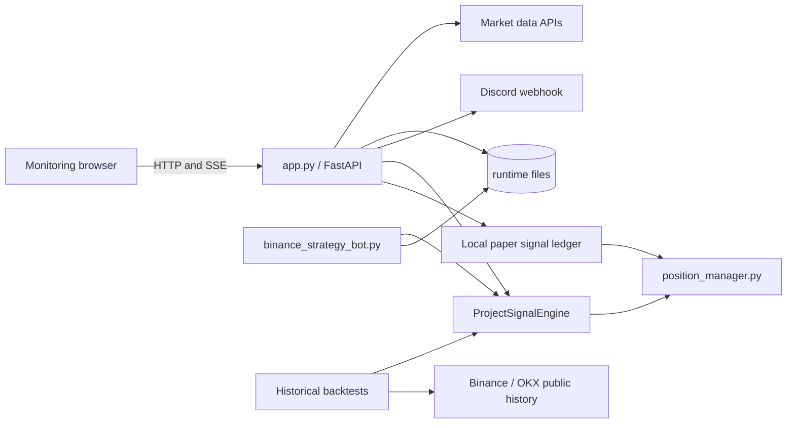

# Architecture and entry-point guide

## System map

`ProjectSignalEngine` remains the strategy source of truth. `position_manager.py` is the exchange-independent source of truth for target levels and exit priority. The web monitor records and updates paper observations without exchange execution. Public OKX data remains available for historical research, including the existing cross-market candidate gate.

## Which script should I run?

| Entry point | Purpose | Places orders by default? |
| --- | --- | --- |
| `app.py` | FastAPI monitoring site, SSE, alerts, reports, and paper strategy history | No |
| `binance_strategy_bot.py` | Multi-symbol Binance signal scanner and paper positions | No; no exchange executor |
| `okx_market_cap_bot.py`, `okx_demo_bot.py`, `okx_demo_signal.py`, `okx_order_smoke.py` | Retired entrypoints; print migration guidance and exit 2 | No |
| `discord_diagnose.py` | Configuration/fingerprint and Discord delivery diagnostic | Sends only unless `--no-send` |

## State and concurrency boundary

The web process owns one `MonitorState` guarded by `state_lock`. The lock protects short in-memory snapshots only; network requests and Discord calls occur outside it. FastAPI owns HTTP/SSE and supervises the async monitoring task in the same event loop through its lifespan. Shutdown sets an async stop event, waits for the task, then closes event-loop-local HTTP sessions.

Runtime JSON state is atomically replaced. JSONL event logs rotate according to `EVENT_LOG_MAX_BYTES` and `EVENT_LOG_BACKUP_COUNT` (defaults: 10 MiB and 5 backups). Docker stdout/stderr logs are independently bounded by Compose.

## Configuration boundary

- `config.yaml`: strategy, monitoring intervals, symbols, tolerances, and bot defaults.
- `.env`: secrets, host-specific paths, proxies, and operational overrides.
- `public/config.js`: local-browser bootstrap ports only, because it is needed before an HTTP backend can be reached.
- `docker-compose.yml`: monitoring and historical backtest services only.
- No order override is provided. Legacy deployment switches are rejected before contacting a remote host.

## Signal tracking

The website owns its paper ledger. It deduplicates by symbol, interval, direction,
and signal time, preserves all active observations, and caps completed history.
It persists mark prices and the last processed bar on updates, and restores that
ledger on startup without synthesizing tracks from historical alerts. Removing a
symbol from the watchlist does not remove an already active observation.

Both website frontends consume `signal_tracking.positions`; SSE and polling keep
the displayed reference prices and simulated returns current. Closed observations
stay in recent history with their exit cause and price. These are signal-based
observations, not fills or account positions.
