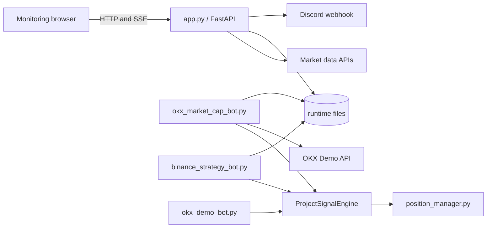

# Architecture and entry-point guide

## System map

`ProjectSignalEngine` remains the strategy source of truth. `position_manager.py` is the exchange-independent source of truth for target levels and exit priority. Exchange adapters retain only market access, order execution, persistence, and notification responsibilities.

## Which script should I run?

| Entry point | Purpose | Places orders by default? |
| --- | --- | --- |
| `app.py` | FastAPI monitoring site, SSE, alerts, reports, and paper strategy history | No |
| `okx_market_cap_bot.py` | Primary multi-symbol OKX Demo strategy bot | No; requires `--place-order` |
| `binance_strategy_bot.py` | Multi-symbol Binance signal scanner and paper positions | No; no exchange executor |
| `okx_demo_bot.py` | Legacy single-symbol OKX Demo bot with startup reconciliation | No; requires `--place-order`; prefer the multi-symbol bot for normal operation |
| `okx_demo_signal.py` | Inspect one signal and optionally submit one Demo order | No; requires `--place-order --size` |
| `okx_order_smoke.py` | Manual OKX Demo order-path smoke test | No; requires `--place-order` |
| `discord_diagnose.py` | Configuration/fingerprint and Discord delivery diagnostic | Sends only unless `--no-send` |

## State and concurrency boundary

The web process owns one `MonitorState` guarded by `state_lock`. The lock protects short in-memory snapshots only; network requests and Discord calls occur outside it. FastAPI owns HTTP/SSE and supervises the async monitoring task in the same event loop through its lifespan. Shutdown sets an async stop event, waits for the task, then closes event-loop-local HTTP sessions.

Runtime JSON state is atomically replaced. JSONL event logs rotate according to `EVENT_LOG_MAX_BYTES` and `EVENT_LOG_BACKUP_COUNT` (defaults: 10 MiB and 5 backups). Docker stdout/stderr logs are independently bounded by Compose.

## Configuration boundary

- `config.yaml`: strategy, monitoring intervals, symbols, tolerances, and bot defaults.
- `.env`: secrets, host-specific paths, proxies, and operational overrides.
- `public/config.js`: local-browser bootstrap ports only, because it is needed before an HTTP backend can be reached.
- `docker-compose.yml`: safe signal-only service topology and resource limits.
- `docker-compose.order.yml`: explicit OKX Demo order-mode override.
